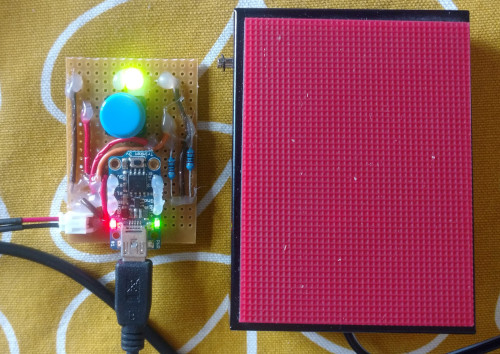

# emacs-vim-clutch

Arduino code for emacs and vim clutch, with button to switch between emacs and vim modes.  
If the button is pressed twice within a second then a fish shell command to launch emacs is issued.

This uses Arduino-Makefile to build and I used [SPI_AVR_loader](https://github.com/zabereer/SPI_AVR_loader) to load it onto Adafruit Trinket 3V.

